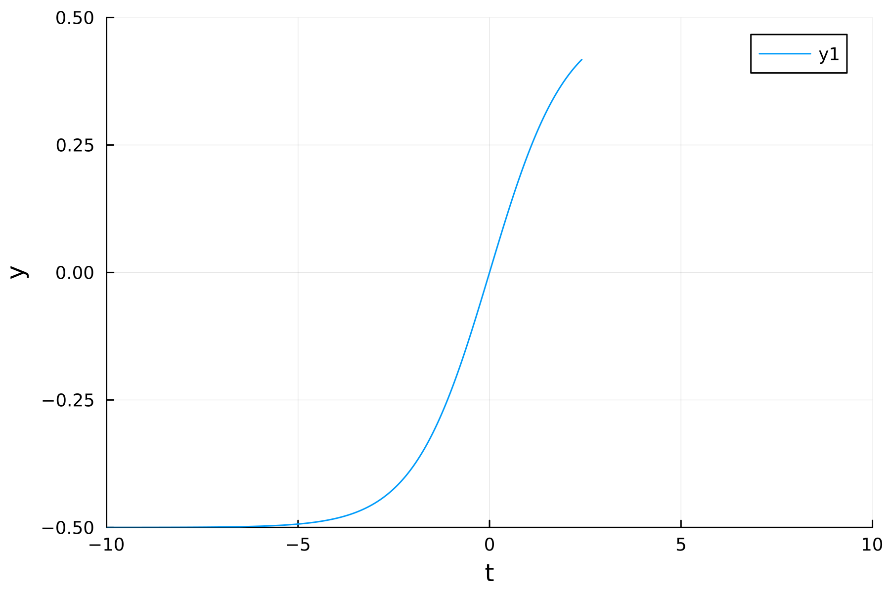

## Timer

If you want to stop the ODE solver after a certain period of time, you can edit the solver option `timer`.

```julia
using RKM
options = SolverOptions(; method = RungeKutta4(), adaptive = Fixed(),
                          timer = TimeLimit(; wtime_minutes = 1),);
```
The timer can only trigger if the max number of minutes `wtime_minutes` is finite (there is no time limit if you use the default value `wtime_minutes = Inf`). We test the timer by modifying a logistic equation with a 10 millisecond pause.

```julia
function dy_dt!(f, y, t; kwargs...)
    f[1] = (y[1] + 0.5) * (0.5 - y[1])
    sleep(1e-2)
    return nothing
end

t0 = -10.0
y0 = [exp(t0)/(1.0 + exp(t0)) - 0.5]
tf = 10.0
dt0 = 1e-2
```

Upon precompiling, you should see the solver stop after about one minute.

```julia
julia> @time sol = evolve_ode(y0, t0, tf, dt0, dy_dt!, options);

┌ Warning: Exceeded time limit of 1.0 minutes (stopping solver...)
└ @ RKM ~/Desktop/RKM.jl/src/timer.jl:119
 63.731024 seconds (31.71 M allocations: 1.593 GiB, 0.56% gc time, 6.22% compilation time)
```

The solver still outputs part of the solution, which we can plot with

```julia
using Plots; plotly()
t, y = get_solution(sol)
plot(t, y; xlabel = "t", ylabel = "y", xlims = (t0, tf), ylims = (-0.5, 0.5))
```

```@raw html

```

### Runtime checks

By default, the solver checks every time step whether the runtime has exceeded the limit. You might notice some additional overhead if your ODE function is very fast. If you want to check the runtime less often, increase the `step_interval` argument (default value is 1).

```julia
timer = TimeLimit(; wtime_minutes = 1, step_interval = 10)
```

## Progress bar

You can track the solver's progress in real time by setting the solver option `show_progress = true`.

```julia
options = SolverOptions(; method = RungeKutta4(), adaptive = Fixed(),
                          timer = TimeLimit(; wtime_minutes = 1),
                          show_progress = true);
```

When you rerun the solver, it will display a progress bar showing the time span percentage completed.

```julia
julia> sol = evolve_ode(y0, t0, tf, dt0, dy_dt!, options);
  Progress:  62%|████████████████████████████▌                 |  ETA: 0:00:37 ( 0.97  s/it)
       runtime: 00:01:00
   total_steps: 1245
             t: 2.449999999999823
            dt: 0.01
┌ Warning: Exceeded time limit of 1.0 minutes (stopping solver...)
└ @ RKM ~/Documents/RKM.jl/src/timer.jl:119
```

In addition to the progress bar, we display several internal variables in real time:

- `runtime`: the current runtime
- `total_steps`: the number of time steps taken
- `t`: the ODE time variable
- `dt`: the time step used by the solver

You can track how long the solver has been running and how fast (or slow) it is progressing.

The progress bar and internal variables usually refresh every second of real time. However, the refresh rate will be slower if your ODE function takes longer than one second to compute.

```@autodocs
Modules = [RKM]
Pages   = ["src/timer.jl",
           "src/progress.jl"]
```