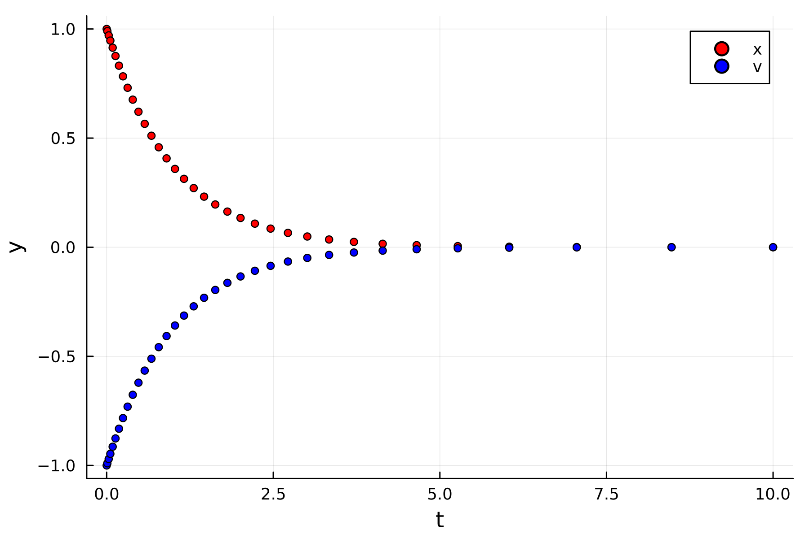
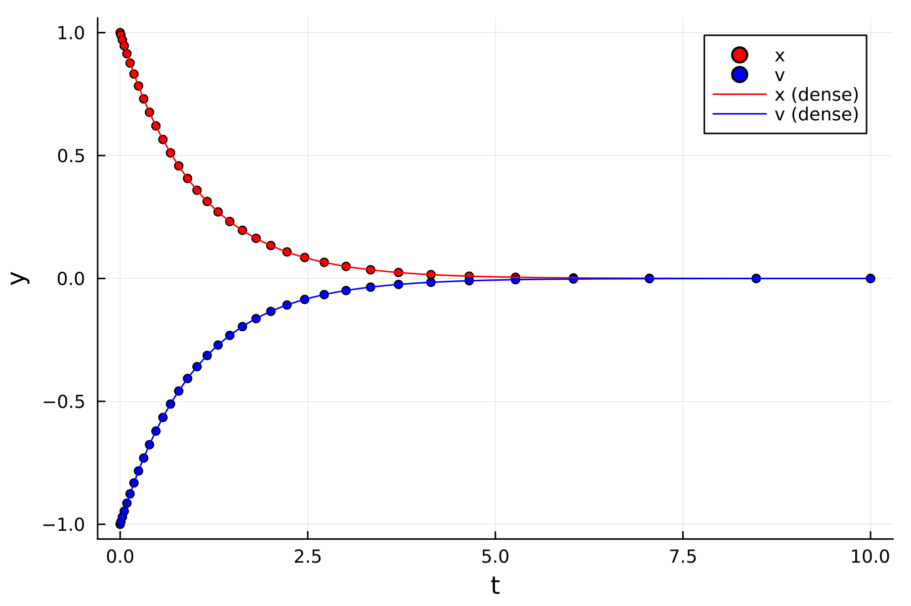
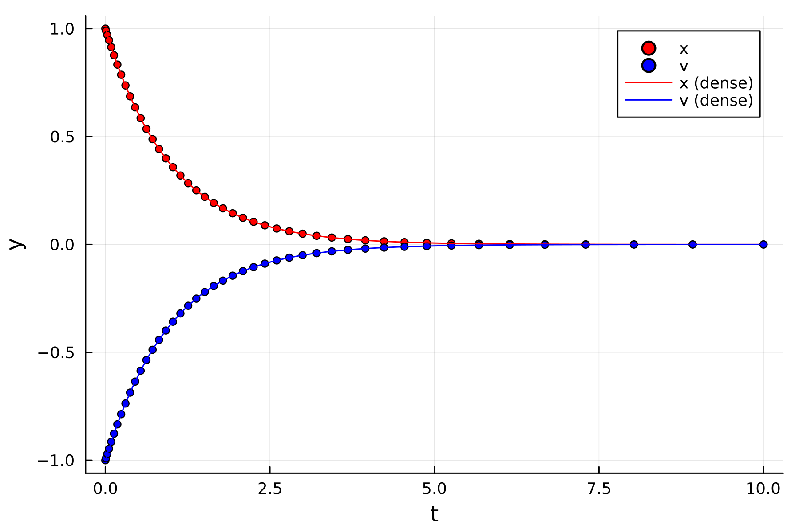

# Dense output

Interpolation can only be performed after solving the ODE, since it uses raw solution data as input.
In addition to the state variables, the cubic Hermite and continuous formula routines use time derivative and intermediate stage data, respectively. You will need to change the solver option `interpolator` to solve and store the solution variables required by each routine.

## No interpolation

If you do not plan to interpolate the solution, use the default value `interpolator = NoInterpolator()`. The solver will only output the time series and state variables of the raw solution.

## Cubic Hermite

All ODE methods can use cubic Hermite interpolation to generate dense output. Here, we continue with the overdamped oscillator example and set the solver option `interpolator = CubicHermite()`. The solver will output the time derivatives, which is stored in `sol.f`.

```julia
options = SolverOptions(; method = TrapezoidRuleBDF21(),
                          adaptive = Embedded(; alpha = 1e-3),
                          interpolator = CubicHermite(),);

sol = evolve_ode(y0, t0, tf, dt0, dy_dt!, options, p);
```

First, we plot the non-uniform solution data from the adaptive TRBDF2 method:

```julia
t, y = get_solution(sol);
scatter(t, y; xlabel = "t", ylabel = "y", label = ["x" "v"], color = [:red :blue], ms = 3)
```

```@raw html

```

Next, we call `interpolate_solution` to interpolate the data uniformly (the keyword argument `dt_dense` controls the temporal spacing).

```julia
t_dense, y_dense = interpolate_solution(options, sol; dt_dense = 1e-4);
plot!(t_dense, y_dense; label = ["x (dense)" "v (dense)"], color = [:red :blue])
```

The interpolated solution is $C^1$ continuous and third-order accurate (i.e. it has a local error of $\mathcal{O}(\Delta t_n^4)$ between the raw time intervals $[t_n, t_{n+1}]$).

```@raw html

```

## Continuous formula

If the ODE method has a continuous formula that uses intermediate stages, you can set `interpolator = ContinuousFormula()`. After solving the ODE, the intermediate stage data will be stored in `sol.dy`.

```julia
options = SolverOptions(; method = TrapezoidRuleBDF21(),
                          adaptive = Embedded(; alpha = 1e-3),
                          interpolator = ContinuousFormula(),);

sol = evolve_ode(y0, t0, tf, dt0, dy_dt!, options, p);
```

Then call `interpolate_solution` to use the continuous formula. The function also displays the formula's order and degree of continuity (either $C^0$ or $C^1$).

```julia
julia> t_dense, y_dense = interpolate_solution(options, sol; dt_dense = 1e-4);
[ Info: Generating order-2 C0 continuous output for TrapezoidRuleBDF21
```

The TRBDF2 continuous formula is less accurate and smooth than cubic Hermite interpolation, but it qualitatively produces the same curves:

```julia
t, y = get_solution(sol);
scatter(t, y; xlabel = "t", ylabel = "y", label = ["x" "v"], color = [:red :blue], ms = 3);
plot!(t_dense, y_dense; label = ["x (dense)" "v (dense)"], color = [:red :blue])
```

```@raw html

```

### Compatibility with step-doubling

You can still use the continuous formula if you used step-doubling for the adaptive time step. However, the raw solution's global accuracy is reduced by one order (the solver updates the state with a regular time step instead of an extrapolated step).

```julia
options = SolverOptions(; method = TrapezoidRuleBDF2(),
                          adaptive = Doubling(),
                          interpolator = ContinuousFormula(),);

sol = evolve_ode(y0, t0, tf, dt0, dy_dt!, options, p);

t, y = get_solution(sol);
t_dense, y_dense = interpolate_solution(options, sol; dt_dense = 1e-4);

scatter(t, y; xlabel = "t", ylabel = "y", label = ["x" "v"], color = [:red :blue], ms = 3);
plot!(t_dense, y_dense; label = ["x (dense)" "v (dense)"], color = [:red :blue])
```

```@raw html

```

We recommend using the continuous formula with an embedded Runge-Kutta method instead.

