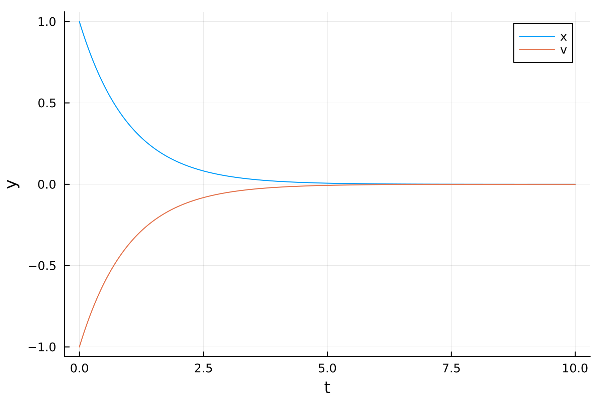
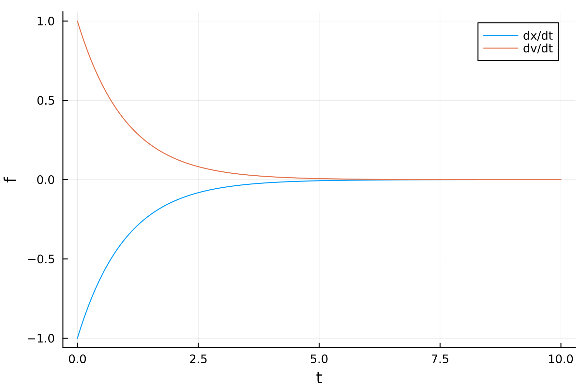

# Solution output

After solving the ODE, you can plot the time series data stored in the `Solution` struct `sol`.
The following sections are based on the overdamped harmonic oscillator:

```julia
using RKM
using Plots; plotly()

function dy_dt!(f, y, t; p, kwargs...)
    γ = p[1]
    ω = p[2]
    f[1] = y[2]
    f[2] = -γ*y[2] - ω^2*y[1]
    return nothing
end

y0 = [1.0, -1.0]  # [position, velocity]
t0 = 0.0
tf = 10.0
dt0 = 1e-2

ω = 10.0          # frequency
γ = ω^2 + 1.0     # damping coefficient
p = [γ, ω]

options = SolverOptions(; method = RungeKutta4(), adaptive = Fixed(),);

sol = evolve_ode(y0, t0, tf, dt0, dy_dt!, options, p);
```

## Time and state variables

The time series $t = (t_0, ..., t_n)$ is stored in `sol.t`. The state variables `sol.y` are stored in linear column format as $\vec{y}(t) = (\vec{y}_0, ..., \vec{y}_n)$.

```julia
julia> sol.t
1002-element Vector{Float64}:
  0.0
  ⋮
 10.0
julia> sol.y
2004-element Vector{Float64}:
  1.0
 -1.0
  ⋮
  4.5399929800627256e-5
 -4.5399929800627256e-5
```

To plot the state variables versus time, we reshape `sol.y` into a transposed matrix by calling the function `get_solution`:

```julia
julia> t, y = get_solution(sol);
julia> y
1002×2 transpose(::Matrix{Float64}) with eltype Float64:
 1.0         -1.0
 ⋮
 4.53999e-5  -4.53999e-5
```

Each column in `y` corresponds to the time series solution of each state variable. Then you can plot the solution with
```julia
plot(t, y; xlabel = "t", ylabel = "y", label = ["x" "v"])
```

```@raw html

```

## Time derivatives

You can set the solver option  `save_time_derivative = true` to save the first-order time derivatives $\vec{f} = d\vec{y}/dt$.
```julia
options = SolverOptions(; method = RungeKutta4(), adaptive = Fixed(),
                          save_time_derivative = true,);

sol = evolve_ode(y0, t0, tf, dt0, dy_dt!, options, p);
```
*Note: using the solver option `interpolator = CubicHermite()` will also output the time derivatives.*

The time derivative data is stored in `sol.f` as a linear column (same as `sol.y`). You can plot them by doing

```julia
t, f = get_time_derivative(sol);
plot(t, f; xlabel = "t", ylabel = "f", label = ["dx/dt" "dv/dt"])
```

```@raw html

```

## Sensitivity coefficients

## API Reference

```@autodocs
Modules = [RKM]
Pages   = ["src/solution/solution.jl"]
```
